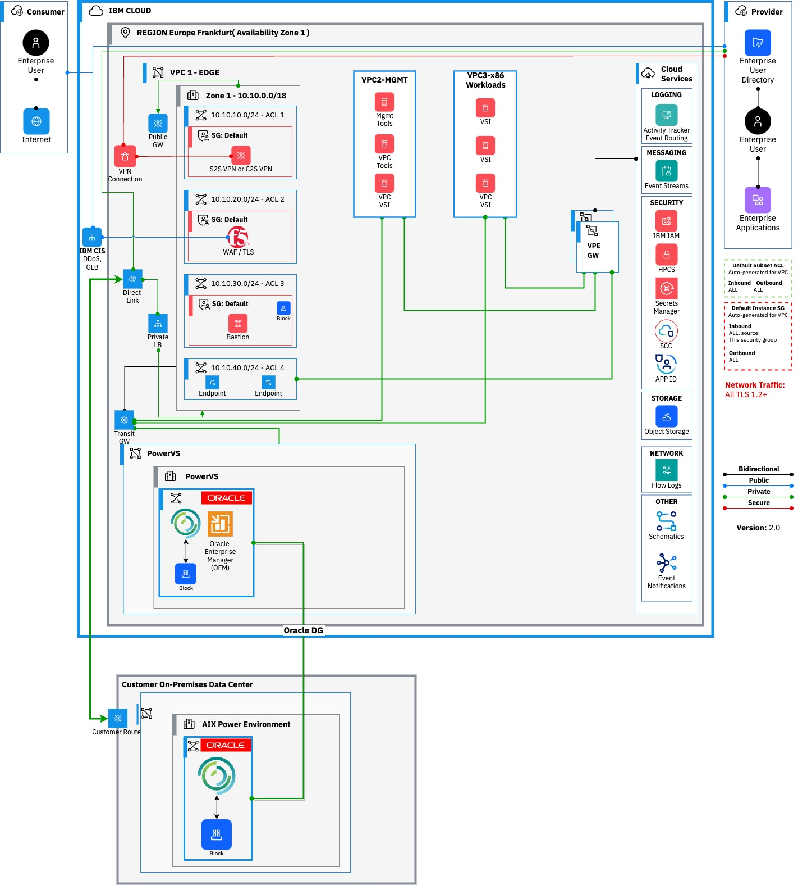
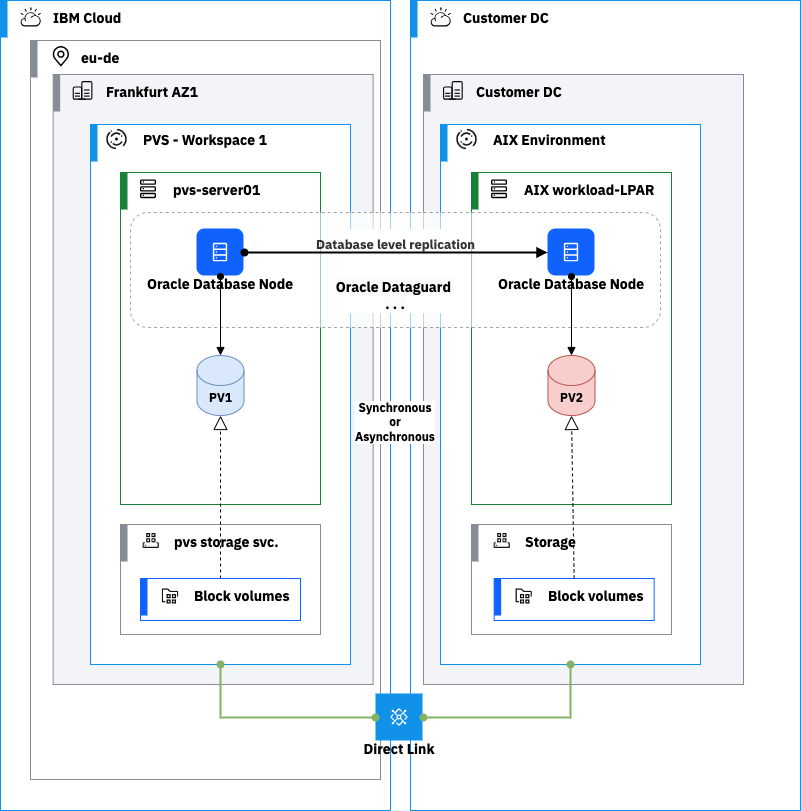

---
copyright:
  years: 2023
lastupdated: "2023-11-28"

subcollection: <repo-name>

keywords:

# The release that the reference architecture describes
version: 1.0

# Use if the reference architecture has deployable code.
# Value is the URL to land the user in the IBM Cloud catalog details page for the deployable architecture.
# See https://test.cloud.ibm.com/docs/get-coding?topic=get-coding-deploy-button
deployment-url: url

# use-case from 'code' column in
# https://github.ibm.com/digital/taxonomy/blob/main/topics/topics_flat_list.csv
use-case:

# industry from 'code' column in
# https://github.ibm.com/digital/taxonomy/blob/main/industries/industries_flat_list.csv
industry:

# compliance from 'code' column in
# https://github.ibm.com/digital/taxonomy/blob/main/compliance_entities/compliance_entities_flat_list.csv
compliance:

content-type: reference-architecture

---

{{site.data.keyword.attribute-definition-list}}

{{site.data.keyword.attribute-definition-list}}

# Reference Architecture 2: Oracle Database Disaster Recovery between Customer DC and IBM PowerVS

In this section, we cover common use cases for Oracle Disaster Recovery approach between IBM Power virtual server and Customer existing Data center.

-   [Oracle Disaster Recovery using Oracle Data Guard](#oracle-disaster-recovery-using-oracle-data-guard)

    For the purpose of this document, it is assumed that the primary workload is hosted on IBM Power Systems Virtual Server workspace and the Disaster recovery is hosted in a customer or 3rd Party Data center, however the workloads can also be reversed where the secondary workload is in IBM PowerVS and the Primary workload is in the customer Data center.

**Architecture overview**

Figure 4 shows high level deployment architecture with Oracle Data Guard and without Oracle Data Guard. It considers IBM PowerVS hosting as the primary site and the customer Data Center as the secondary site (DR). IBM VPC hosts common shared services such as IAM, DNS, Monitoring, management tools, and x86 workloads.

Figure 4 IBM Power Virtual Server environment and On-premises overview diagram featuring VPC and PowerVS workspace.

-   Primary environment is IBM Frankfurt region and Secondary environment is customer’s existing Data Center.
-   Configure network connectivity which will be accomplished through Direct Links to primary region with VPN access for Managed Service Provider(s) (MSPs).
-   An Edge VPC is deployed which contains routing and security functions. For security purposes, all ingress and egress traffic will route through the Edge VPC. It contains an SFTP server, Bastion host (jump), Firewalls providing advanced security functions.
-   The Edge VPC is connected to the PowerVS environment through a local Transit Gateway. The PowerVS environment hosts the Oracle DB, the rest of the customer environment is hosted in VPC.
-   Public connectivity routes through Cloud Internet services which can provide load balancing, failover, and DDoS services, then routes to the edge VPC
-   The VPC connections to the PowerVS environment via a TGW and GRE tunnel.
-   Virtual Private endpoints are used to provide connectivity to cloud native services from each VPC.
-   Ensure the connectivity from customer environment is established to IBM PowerVS and security aspects are considered. To address the networking requirements, ensure to follow steps at following [link](https://cloud.ibm.com/docs/power-iaas?topic=power-iaas-network-architecture-diagrams).
-   Oracle DB are installed in LPARS with multiple Tier 1 LUNs for OS and DB that are used for boot and Database executable and to store DB schema.

# Oracle Disaster Recovery using Oracle Data Guard

The Oracle Disaster recovery solution approach across IBM PowerVS and customer Data center are described below. This approach uses Oracle Data Guard to achieve Disaster recovery of Oracle DB across IBM Power Virtual Server and the customer Data Center.

Figure 5 Oracle Disaster Recovery across Power Virtual Server environment and on-premises using Oracle DG replication methods.

The reference architect to host Oracle Database and x86 workloads on IBM cloud, includes key components required for oracle deployment on the Power Virtual Server environment.

The primary environment workloads hosted in IBM include:

-   VPC environment
    -   Edge VPC cluster: hosts security components, firewall, and other edge services which are essentials for your environment.
    -   Management VPC cluster: hosts all the management tool stack needed to manage VPC and Power VS environments.
    -   Workload VPC cluster: hosts IBM VPC Virtual Server Instance (VSI) workloads. (x86 workloads).
    -   Transit gateway: connects VPC and Power Virtual workspace.
    -   Direct Link: connectivity to IBM cloud from customer’s existing Data center and other regional offices.
    -   VPN connection: for managed services to provide cloud managed operations.
    -   Load Balancer: if the customer external load balancing.
    -   Cloud internet Service: if DDoS and global load balancing is required.
    -   Virtual Private end points: are used to provide connectivity to cloud native services from each VPC. Monitoring tools: Activity tracker, Log DNA, and customer’s custom tools.
    -   Backup Environment via IBM Storage Protect or Veeam.
-   Power VS Environment
    -   Workload power VS cluster: actual Oracle Database primary instance.
    -   Storage required for LPARS.
    -   Cloud Object Storage configured for backup.

        **Customer Data Center:** This is the disaster recovery site.

-   Ensure you have all hardware components configured to meet your Primary workload requirements running in the IBM Power Virtual Server environment.
-   Ensure compute, storage, networking, security requirements, and pre-requisites are addressed for Oracle to replicate across both the sites. ([reference section 9.0](#_References))

    *Note: Carefully consider options for synchronous and asynchronous replication when designing database replication to meet the client requirements. It is recommended that you discuss latency between environments before you decide on a replication method for Oracle.*

    Table showing the components used for Oracle replication

| Software Component        | Target system component | Description                                          |
|---------------------------|-------------------------|------------------------------------------------------|
| DB replication Data Guard | Installed on LPAR       | Used for Oracle DB replication across another site.  |

Note:

Active Data Guard allows you to read while the data is syncing. There is no need to pause they sync process

# Deployment Architecture Guidance

Ensure you have completed the pre-requisites for IBM Power Virtual Server environment connectivity. Follow the necessary steps for a secured connection needed for a Power Virtual server environment. The Customer Data center connection to IBM Power virtual servers details are described here [cloud docs](https://cloud.ibm.com/docs/power-iaas?topic=power-iaas-network-architecture-diagrams). For additional information please reference [section 9.0](#_References) for helpful links.

-   [Connecting to VPC via Direct link](https://cloud.ibm.com/docs/power-iaas?topic=power-iaas-ordering-direct-link-connect).
-   [Connecting to Customer DC via Mega port](https://cloud.ibm.com/docs/power-iaas?topic=power-iaas-network-architecture-diagrams#network-reference-architecture-onprem).

    Reference the below process to configure the Power Virtual Server and Oracle Database.

1.  [Install and Configure AIX LPARs and LUNs](https://cloud.ibm.com/docs/power-iaas?topic=power-iaas-creating-power-virtual-server).
2.  Install Oracle DB and configure LUNs on tier 1.
3.  Configure and test Oracle Data Guard across both the site ensuring replication across sites meets your objective.

# Backup & Restore Architecture Guidance

A major consideration when designing a backup solution is the client’s RTO/RPO requirements. Ensure a local copy of backup is scheduled and completes successfully at each site. Restores from backup should be tested. [See section 4.5 for backup and restore](#_Backup_and_Restore).

-   All Production Databases require a Backup/Restore infrastructure. Ensure you have infrastructure in the Power Virtual Server environment and the client Data Center.
-   It is recommended to perform RMAN Oracle Database backups in both the IBM Power Virtual Server environment and the client data center environment. RMAN provides database consistent level backups. This will ensure point in time recovery in both primary and secondary environments.
-   It is recommended to use IBM Storage Protect for file and OS backup in the Power Virtual Server environment.

# Networking Architecture Guidance

Networking is covered in [section 4.3](#_Network_Architecture_Decisions).

# Disaster Recovery Architecture Guidance

It is essential to consider both the local high availability and the remote disaster recovery requirements when solutioning for Oracle Data Guard.

Baseline components of the Oracle Data Guard disaster recovery architecture include:

-   Asynchronous Replication: Use Data Guard with asynchronous replication to the DR site to minimize the impact on performance of production Databases.
-   Network: Ensure a direct link is setup between the IBM Power Virtual Server environment and customer Data Center sites.
-   Version of LPARS across both sites.
-   Oracle Versions across both sites.
-   Oracle Enterprise edition licenses.
-   Oracle pre-requisite for Data Guard. ([refer to Oracle requirements on oracle site](https://docs.oracle.com/en/database/oracle/oracle-database/23/dgbkr/oracle-data-guard-broker-installation-requirements.html#GUID-21393DF3-FD7E-44AA-A90C-6533E03CBDDA))
