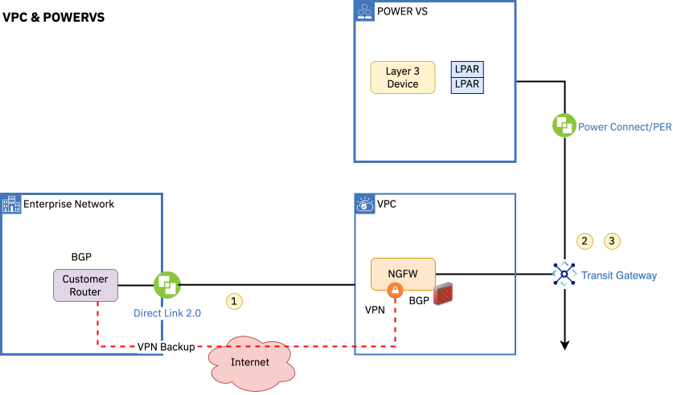

---
copyright:
  years: 2023
lastupdated: "2024-05-29"

keywords: # Not typically populated

subcollection: pattern-oracle-disaster-recovery-on-powervs
authors:
  - name: Dwarkanath P Rao
    url: https://www.linkedin.com/in/dwarakanath/

# The release that the reference architecture describes
version: 1.0

# Use if the reference architecture has deployable code.
# Value is the URL to land the user in the IBM Cloud catalog details page for the deployable architecture.
# See https://test.cloud.ibm.com/docs/get-coding?topic=get-coding-deploy-button
deployment-url:

docs: https://cloud.ibm.com/docs/pattern-oracle-disaster-recovery-on-powervs
# use-case from 'code' column in
# https://github.ibm.com/digital/taxonomy/blob/main/topics/topics_flat_list.csv
use-case: cloud

content-type: reference-architecture
---
{{site.data.keyword.attribute-definition-list}}

# Oracle Database Disaster Recovery on IBM PowerVS Cross Region
{: #Oracle-dr-ibm-pvs}
{: toc-content-type="reference-architecture"}
{: toc-use-case="cloud"}
{: toc-version="1.0"}

## Architecture diagram

{: #architecture-diagram}

The reference architecture covers a solution overview and details on how to design an Oracle Disaster recovery deployable architecture on IBM Power Virtual Server environment.

This reference architecture assumes that there are more non-Oracle Database x86 workloads that are hosted in the IBM Cloud VPC environment. The key components outlined here are required for an Oracle Database deployment on Power Virtual Server and x86 workloads on VPC in two IBM regions.

The following figure describes an architecture approach for deploying a disaster recovery solution for Oracle Database across IBM PowerVS regions.

{: caption="Figure 1. Oracle Disaster Recovery Solution" caption-side="bottom"}

### Deploying environments in this reference architecture

{: #environments-deployed}

- VPC environment

  - Edge VPC cluster: Hosts security components, firewall, and other edge services that are essential for a secure environment.
  - Management VPC cluster: Hosts all the management tool stacks that are needed to manage VPC and PowerVS environments.
  - Workload VPC cluster: The location where the IBM VPC virtual server instance (VSI) workloads are hosted(includes x86 workloads).
  - Transit gateway: Used to connect VPC and Power Virtual workspace.
  - Direct Link: Used to connect to IBM Cloud from the customer’s existing data center and other regional offices.
  - VPN connection: The connection for managed services to provide cloud-managed operations.
  - Load Balancer: An option if the customer needs a private application load balancer.
  - Cloud internet Service: An option  if public global load balancing or DDoS services are needed.
  - Virtual Private end points: Used for connecting to IBM Cloud services over the private network such as Activity Tracker, Event Streams, or Cloud Object Storage.
  - Monitoring tools: Tools include Activity tracker, Log DNA and IBM Cloud Monitoring.
  - Backup Environment through IBM Storage Protect or Veeam
- Power VS Environment

  - Workload Power VS cluster: The actual Oracle Database instance.
  - Storage that's required for Logical Partitions (LPARS).
  - Cloud Object Storage is configured for backup.

### Oracle Disaster Recovery that uses Oracle Data Guard

{: #oracle-data-guard}

In this section, we look at how to use Oracle Database Enterprise edition and use the Oracle Data Guard feature for disaster recovery. We set up a database instance in IBM PowerVS primary region and secondary region and configure Data Guard failover for disaster recovery.

The following figure illustrates the reference architecture based on Oracle Data Guard.

- Two IBM Power Virtual Server environment regions, for example, FRA AZ1 (FRA02) and MAD AZ1 (MAD02).
- Oracle Database is installed on IBM Power Virtual Server LPARS in two separate Regions
- Oracle Database Enterprise Edition that includes Data Guard, is used to provide real-time replications across the two separate Oracle Databases in each region over a Global Transit Gateway.
- The primary region is Frankfurt and the secondary region is Madrid.

{: caption="Figure 2. Oracle Disaster Recovery across regions" caption-side="bottom"}

### Deployment guidance

{: #deployment-guidance}

Review the key steps for setting up the Oracle Database and Data Guard in IBM Power Systems Virtual Server.

- Ensure that you have a proper connection that is established between your on-premises data center to IBM Power Systems virtual Server regions.
- [Validate network connectivity](/docs/power-iaas?topic=power-iaas-network-architecture-diagrams)
- [Configure a private subnet](/docs/power-iaas?topic=power-iaas-configuring-subnet)
- [Configure VPN for managed service team such as a Day 2 operation team needs VPN access](/docs/power-iaas?topic=power-iaas-VPN-connections)
- [Site to Site VPN for resiliency purpose](https://cloud.ibm.com/media/docs/downloads/power-iaas-tutorials/PowerVS_VPN_Tutorial_v1.pdf){: external}
- [Configure and integrate with VPC environment](/docs/power-iaas?topic=power-iaas-powervs-integration-x86-workloads)
- [Create a primary LPARS that runs database servers](/docs/power-iaas?topic=power-iaas-creating-power-virtual-server#creating-power-virtual-server). This includes both sites: primary and secondary.
- Create and attach disks for Oracle software that is provided by IBM PowerVS (tier 1)
- Optional: [Importing a boot image](/docs/power-iaas?topic=power-iaas-importing-boot-image)
- Configure the operating system for Oracle (exact steps depending on the operating system)
- [Install Oracle Database according to Oracle guidance and recommendations](https://docs.oracle.com/en/database/oracle/oracle-database/23/dgbkr/oracle-data-guard-broker-installation-requirements.html#GUID-21393DF3-FD7E-44AA-A90C-6533E03CBDDA){: external}
- Install and configure the Oracle Data Guard software

As a best practice, create a non-production environment similar to a production setup, but non-production can have tier 3 storage and lower CPU as they don’t have high-performance requirements.
{: note}

### Network architecture guidance

{: #network-guidance}

{: caption="Figure 3. IBM Power Virtual server environment networking topology" caption-side="bottom"}

This figure shows required network components from customer Data center to IBM Power Systems Virtual Server.

Make sure that you have a proper networking architecture and connection that is established from your on-premises data center to an IBM Power Systems virtual server workplace. Refer to guidance on [IBM Cloud docs](/docs/power-iaas?topic=power-iaas-network-architecture-diagrams).

1. Establish Direct 2.0 Link to VPC IBM Cloud account
2. Enable Transit Gateway to connect PowerVS and VPC. Have the right VLAN created when you set up your account for VPC and PowerVS
3. PowerVS Connection to global TGW

## Design scope

{: #design-scope}

This document provides design recommendations for an Oracle Database deployment on IBM Power Virtual Server environment to meet disaster recovery requirements. It covers the following resiliency patterns including cross-region disaster recovery of Oracle Database that uses Oracle Data Guard.

Following the [Architecture Design Framework](/docs/architecture-framework?topic=architecture-framework-intro), the Oracle disaster recovery on IBM Power Virtual Systems Server architecture covers resiliency, design considerations, and architecture decisions for the following aspects and domains:

- **Compute:** Virtual Servers
- **Storage:** Primary Storage, Backup Storage
- **Networking:** Enterprise Connectivity, Segmentation and Isolation, Cloud Native Connectivity, Load Balancing, Domain Name System
- **Security:** Data Security, Identity and Access Management, Application Security, Infrastructure and Endpoint Security
- **Resiliency:** High Availability, Backup and Restore,
- **Service Management:** Monitoring, Logging, Auditing, Alerting

{: caption="Figure 4. Architecture Design Framework" caption-side="bottom"}

The Architecture Design Framework provides a consistent approach to design cloud solutions by addressing requirements across a set of aspects and domains, which are technology-agnostic architectural areas that need to be considered for any enterprise solution. For more information, see [Introduction to the Architecture Design Framework](/docs/architecture-framework?topic=architecture-framework-intro).

## Requirements

{: #requirements}

The following represents a baseline set of requirements that we believe are applicable to most clients and critical to successful Oracle Disaster Recovery deployment. This set of requirements are key considerations for a successful disaster recovery setup of power workloads and other co-existing applications in IBM Power Systems Virtual Server environments, IBM Cloud, and customer Data Centers.

| Aspect                                                    | Requirements                                                                                                                                                                                                                                                                                                                                                                                                                                                                                                                                                                                                                                                                                                      |
| --------------------------------------------------------- | ----------------------------------------------------------------------------------------------------------------------------------------------------------------------------------------------------------------------------------------------------------------------------------------------------------------------------------------------------------------------------------------------------------------------------------------------------------------------------------------------------------------------------------------------------------------------------------------------------------------------------------------------------------------------------------------------------------------- |
| Compute                                                   | Provide properly isolated compute resources with adequate compute capacity for the applications.                                                                                                                                                                                                                                                                                                                                                                                                                                                                                                                                                                                                                  |
| Storage                                                   | Provide storage that meets the application and database performance requirements.                                                                                                                                                                                                                                                                                                                                                                                                                                                                                                                                                                                                                                 |
| Networking                                                | * Deploy workloads in an isolated environment and enforce information flow policies. \n * Provide secure, encrypted connectivity to the cloud’s private network for management purposes. \n * Distribute incoming application requests across available compute resources. \n * Provide public and private DNS resolution to support the use of hostnames instead of IP addresses.                                                                                                                                                                                                                                                                                                                               |
| Security                                                  | * Ensure that all operator actions are run securely through a bastion host. \n * Protect the boundaries of the application against denial-of-service and application-layer attacks. \n * Encrypt all application data in transit and at rest to protect it from unauthorized disclosure. \n * Encrypt all backup data to protect it from unauthorized disclosure. \n * Encrypt all security data (operational and audit logs) to protect from unauthorized disclosure. \n * Encrypt all data by using customer-managed keys to meet regulatory compliance requirements for more security and customer control. \n * Protect secrets through their entire lifecycle and secure them using access control measures. |
| Resiliency                                                | Support application availability targets and business continuity policies. \n * Provide highly available compute, storage, network, and other cloud services to handle application load and performance requirements. \n * Backup application data to enable recovery if unplanned outages occur. \n * Provide highly available storage for security data (logs) and backup data.                                                                                                                                                                                                                                                                                                                                 |
| Service Management                                        | * Monitor system and application health metrics and logs to detect issues that might impact the availability of the application. \n * Generate alerts/notifications about issues that might impact the availability of applications to trigger appropriate responses to minimize downtime. \n * Monitor audit logs to track changes and detect potential security problems. \n * Provide a mechanism to identify and send notifications about issues that are found in audit logs.                                                                                                                                                                                                                                |
| {: caption="Table 1. Requirements" caption-side="bottom"} |                                                                                                                                                                                                                                                                                                                                                                                                                                                                                                                                                                                                                                                                                                                   |

## Components

{: #components}

The common solution components that are listed in the following table are those components that are needed for both scenarios.

| Aspects                                                 | Architecture components                                                                                                                                                                                                                                                                                                                                                                                                                                                                                                                                                                 | How the component is used                                                                                                                                 |
| ------------------------------------------------------- | --------------------------------------------------------------------------------------------------------------------------------------------------------------------------------------------------------------------------------------------------------------------------------------------------------------------------------------------------------------------------------------------------------------------------------------------------------------------------------------------------------------------------------------------------------------------------------------- | --------------------------------------------------------------------------------------------------------------------------------------------------------- |
| Compute                                                 | [VPC VSIs](https://cloud.ibm.com/vpc-ext/provision/vs){: external}, [IBM Power Virtual Server](/docs/power-iaas?topic=power-iaas-getting-started)                                                                                                                                                                                                                                                                                                                                                                                                                                             | Oracle Database, other non-Oracle application that is hosted on cloud Non-Oracle workloads that are run on x86 (VPC) and Oracle workloads runs on PowerVS |
| Storage                                                 | Tier 1 Power Virtual Server Storage                                                                                                                                                                                                                                                                                                                                                                                                                                                                                                                                                     | Database servers storage                                                                                                                                  |
|                                                         | Tier 3 Power Virtual Server Storage                                                                                                                                                                                                                                                                                                                                                                                                                                                                                                                                                     | Archive or backup storage                                                                                                                                 |
|                                                         | [Cloud Object Storage](/docs/cloud-object-storage?topic=cloud-object-storage-about-cloud-object-storage)                                                                                                                                                                                                                                                                                                                                                                                                                                                                                   | Backups and Logs (application, operational, and audit logs)                                                                                               |
|                                                         | [Block Storage](/docs/vpc?topic=vpc-block-storage-about#vpc-storage-encryption)                                                                                                                                                                                                                                                                                                                                                                                                                                                                                                            | Block storage for VPC VSI images on x86 workloads                                                                                                         |
| Networking                                              | [Transit Gateway](/docs/transit-gateway?topic=transit-gateway-about)                                                                                                                                                                                                                                                                                                                                                                                                                                                                                                                       | Connects across VPCs and PowerVS                                                                                                                          |
|                                                         | [VPC Virtual Private Network (VPN)](/docs/iaas-vpn?topic=iaas-vpn-getting-started)                                                                                                                                                                                                                                                                                                                                                                                                                                                                                                         | Remote access to manage resources in a private network                                                                                                    |
|                                                         | [Virtual Private Gateway &amp; Virtual Private Endpoint (VPE)](/docs/vpc?topic=vpc-about-vpe)                                                                                                                                                                                                                                                                                                                                                                                                                                                                                              | Private network access to Cloud Services, for example Key Protect, Cloud Object Storage, and so on.                                                       |
|                                                         | [VPC Application Load Balancers](/docs/vpc?topic=vpc-load-balancers)                                                                                                                                                                                                                                                                                                                                                                                                                                                                                                                       | Application Load Balancing for web servers, app servers, and database servers                                                                             |
|                                                         | [Public Gateway](/docs/vpc?topic=vpc-about-public-gateways)                                                                                                                                                                                                                                                                                                                                                                                                                                                                                                                                | For web server access to the internet                                                                                                                     |
|                                                         | [Cloud Internet Services (CIS)](/docs/cis?topic=cis-getting-started)                                                                                                                                                                                                                                                                                                                                                                                                                                                                                                                       | Public Load balancing of web server traffic across zones in the region                                                                                    |
|                                                         | [DNS Services](/docs/dns-svcs?topic=dns-svcs-about-dns-services)                                                                                                                                                                                                                                                                                                                                                                                                                                                                                                                           | Domain Name System (DNS) for Domain name resolution                                                                                                       |
| Security                                                | [IAM](/docs/account?topic=account-cloudaccess)                                                                                                                                                                                                                                                                                                                                                                                                                                                                                                                                             | IBM Cloud Identity & Access Management                                                                                                                    |
|                                                         | [BYO Bastion Host on VPC VSI with PAM SW](/docs/framework-financial-services?topic=framework-financial-services-vpc-architecture-connectivity-bastion-tutorial-teleport)                                                                                                                                                                                                                                                                                                                                                                                                                   | Remote access for administrative functions with Privileged Access Management                                                                              |
|                                                         | [Virtual Private Clouds (VPCs), Subnets, Security Groups, ACLs](/docs/vpc?topic=vpc-getting-started) Isolated PowerVS LPARs                                                                                                                                                                                                                                                                                                                                                                                                                                                                | Network Segmentation/Isolation for Power VS using PVS subnets.                                                                                            |
|                                                         | [Cloud Internet Services (CIS)](/docs/cis?topic=cis-getting-started)                                                                                                                                                                                                                                                                                                                                                                                                                                                                                                                       | Public DDoS protection and Web App Firewall                                                                                                               |
|                                                         | [Key Protect](/docs/key-protect) or [HPCS](/docs/hs-crypto?topic=hs-crypto-get-started)                                                                                                                                                                                                                                                                                                                                                                                                                                                                                  | HSM and Key Management Service (KYOK)                                                                                                                     |
|                                                         | [Secrets Manager](https://cloud.ibm.com/catalog/services/secrets-manager){: external}                                                                                                                                                                                                                                                                                                                                                                                                                                                                                                      | Certificate and Secrets Management                                                                                                                        |
|                                                         | Firewall:[Fortigate](https://cloud.ibm.com/catalog/content/ibm-fortigate-AP-HA-terraform-deploy-5dd3e4ba-c94b-43ab-b416-c1c313479cec-global){: external}, [Juniper vSRX](https://cloud.ibm.com/catalog/content/juniper-vsrx-catalog-deploy-1.4-dc1e707c-33dd-4321-b2a5-c22dbf0dd0ee-global){: external}, [Checkpoint Cloud Guard](https://cloud.ibm.com/catalog/content/checkpoint-iaas-gw-ibm-vpc-1.0.7-9ed8dbde-2931-45f5-a7a7-0c90ce0d2686-global){: external}, [Palo Alto](https://cloud.ibm.com/catalog/content/ibmcloud-vmseries-1.9-6470816d-562d-4627-86a5-fe3ad4e94b30-global){: external} | IPS/IDS protection at all ingress/egress points Unified Threat Management (UTM) Firewall                                                                  |
| Service Management (Observability)                      | [IBM Cloud Monitoring](/docs/monitoring?topic=monitoring-about-monitor)                                                                                                                                                                                                                                                                                                                                                                                                                                                                                                                    | Apps and operational monitoring                                                                                                                           |
|                                                         | [IBM Log Analysis](/docs/log-analysis?topic=log-analysis-getting-started)                                                                                                                                                                                                                                                                                                                                                                                                                                                                                                                  | Apps and operational logs                                                                                                                                 |
|                                                         | [Activity Tracker Event Routing](/docs/atracker?topic=atracker-about)                                                                                                                                                                                                                                                                                                                                                                                                                                                                                                                      | Audit logs                                                                                                                                                |
| {: caption="Table 2. Components" caption-side="bottom"} |                                                                                                                                                                                                                                                                                                                                                                                                                                                                                                                                                                                         |                                                                                                                                                           |

As mentioned, the [Architecture Framework](/docs/architecture-framework?topic=architecture-framework-intro) is used to guide and determine the applicable aspects and domains for which architecture decisions need to be made based on customer requirements. The following sections in this deployment guide contain the considerations and architecture decisions for the aspects and domains that are contained in the PowerVS common elements for both Oracle resiliency solution patterns.
