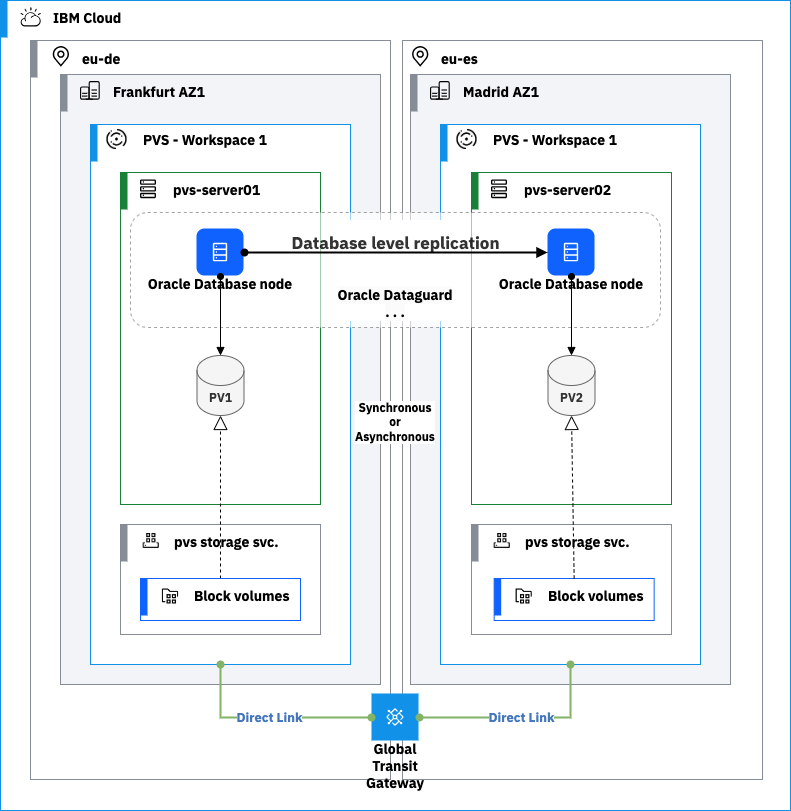
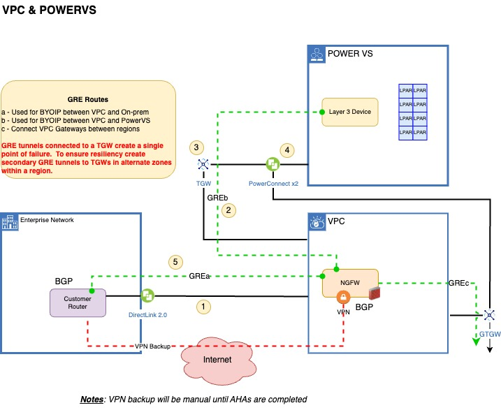
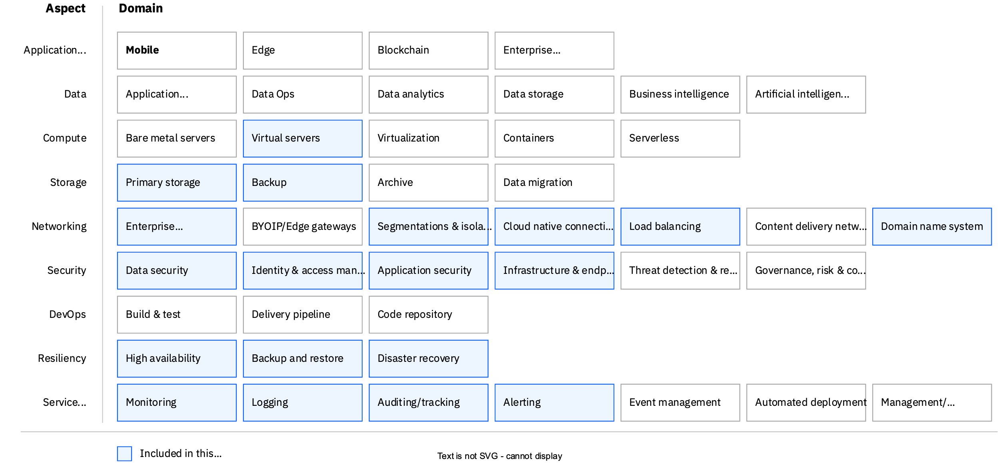

---
copyright:
  years: 2023
lastupdated: "2023-11-28"

subcollection: <repo-name>

keywords:
---
{{site.data.keyword.attribute-definition-list}}

# Reference Architecture 1: Oracle Database Disaster Recovery on IBM PowerVS Cross Region

## Architecture Diagram

The reference architecture covers solution overview and details on how to design a Oracle Disaster recovery architecture on IBM Power Virtual Server environment.

The figure below describes an architecture approach for deploying a disaster recovery solution for Oracle Database across IBM PowerVS regions.

Figure Oracle Disaster Recovery Solution options across two IBM Power Virtual Server environment regions

This reference architecture assumes there are additional, non-Oracle Database x86 workloads that will be hosted in the IBM Cloud VPC environment. Below are key components required for an Oracle Database deployment on Power Virtual Server and x86 workload(s) deployed on VPC in two regions.

**Environment deployed in this reference architecture**

- VPC environment
  - Edge VPC cluster: this hosts security components, firewall, and other edge services which are essentials for a secure environment
  - Management VPC cluster: this hosts all the management tool stack needed to manage VPC and PowerVS environments
  - Workload VPC cluster: this is where IBM VPC virtual server instance (VSI) workloads are hosted(includes x86 workloads)
  - Transit gateway: to connect VPC and Power Virtual workspace
  - Direct Link: to connect to IBM cloud from customer’s existing Data center and other regional offices
  - VPN connection: for managed services to provide cloud managed operations
  - Load Balancer: if the customer needs a private application load balancer
  - Cloud internet Service: if public global load balancing or DDoS services are needed
  - Virtual Private end points: for connecting to IBM cloud services over the private network such as Activity Tracker, Event Streams, or Cloud Object Storage
  - Monitoring tools: Activity tracker, Log DNA, etc
  - Backup Environment via IBM Storage Protect or Veeam
- Power VS Environment
  - Workload Power VS cluster: actual Oracle Database instance
  - Storage required for LPARS
  - Cloud Object Storage configured for backup

**Oracle Disaster Recovery using Oracle Data Guard**

In this section, we will look at how to utilize Oracle Database Enterprise Edition and use Oracle Data Guard feature for disaster recovery. We will set up a database instance in IBM PowerVS primary region & secondary region and configure Data Guard failover for disaster recovery.

The figure below illustrates the reference architecture based on Oracle Data Guard.

- Two IBM Power Virtual Server environment regions i.e., for example FRA AZ1 (FRA02) and MAD AZ1 (AZ1)
- Oracle DB is installed on IBM Power Virtual Server LPARS in two Separate Regions
- Oracle DB Enterprise Edition which includes Data Guard, is used to provide real-time replications across the two separate Oracle Database in each region over a Global Transit Gateway
- Primary is Frankfurt and Secondary is Madrid region

Figure Oracle Disaster Recovery across different IBM PowerVS region using Oracle Data Guard

**Deployment Architecture Guidance**

Here are the key steps for setting up the Oracle database and Data Guard in IBM Power Systems Virtual Server.

- Ensure you have a proper connection established between your on-premises, Data center to IBM Power Systems virtual Server regions.
- [Validate network connectivity](https://cloud.ibm.com/docs/power-iaas?topic=power-iaas-network-architecture-diagrams)
- [Configure private subnet](https://cloud.ibm.com/docs/power-iaas?topic=power-iaas-configuring-subnet)
- [Configure VPN for Managed service team such as Day 2 operation team who will need VPN access](https://cloud.ibm.com/docs/power-iaas?topic=power-iaas-VPN-connections)
- [Site to Site VPN for Resiliency purpose](https://cloud.ibm.com/media/docs/downloads/power-iaas-tutorials/PowerVS_VPN_Tutorial_v1.pdf)
- [Configure and integrate with VPC environment](https://cloud.ibm.com/docs/power-iaas?topic=power-iaas-powervs-integration-x86-workloads)
- [Create Primary LPARS which will run Database servers](https://cloud.ibm.com/docs/power-iaas?topic=power-iaas-creating-power-virtual-server#creating-power-virtual-server) (both sites: Primary and secondary)
- Create and attach disks for Oracle software provided by IBM PowerVS (tier 1)
- Optional If you want to import boot image check [here](https://cloud.ibm.com/docs/power-iaas?topic=power-iaas-importing-boot-image)
- Perform Operating System (OS) prerequisite steps
- [Install Oracle Database according to Oracle guidance and recommendations](https://docs.oracle.com/en/database/oracle/oracle-database/23/dgbkr/oracle-data-guard-broker-installation-requirements.html#GUID-21393DF3-FD7E-44AA-A90C-6533E03CBDDA)
- Install and configure the Oracle Data Guard software

Note: Best practices is to have non Production environment similar to production setup, but non-production can have tier 3 storage and lower CPU as they don’t have high performance requirements.

**Network Architecture Guidance**

Figure IBM Power Virtual server Environment networking tolopogy

The above Figure shows required network components from customer Data center to IBM Power Systems Virtual Server

Please ensure you have a proper networking architecture and connection established from your on-premises, Data center to IBM Power Systems virtual server workplace. Please look for guidance on [IBM docs](https://cloud.ibm.com/docs/power-iaas?topic=power-iaas-network-architecture-diagrams)

1. Establish Direct 2.0 Link to VPC IBM Cloud account
2. Establish a GRE tunnel (GREb) between the Gateway Router in VPC (NGFW) and the PowerVS Layer 3 device (ensure you have right credentials)
3. Enable Transit Gateway to connect PowerVS and VPC. Have the right VLAN created when you setup your account for VPC and PowerVS
4. PowerVS Connection to LTGW and GTGW
5. Establish a GRE tunnel (GREa) between the Gateway Router in VPC (NGFW) **and the** customer router.

## Design scope

{: \#design-scope}

This document provides design recommendations for an Oracle Database deployment on IBM Power Virtual Server environment to meet disaster recovery requirements. It covers resiliency patterns:

Cross-Region Disaster recovery of Oracle Database using Oracle Data Guard

Following the [Architecture Framework](https://cloud.ibm.com/docs/architecture-framework?topic=architecture-framework-intro), the Resiliency Patterns cover design considerations for the following aspects and domains:

The Oracle disaster recovery on IBM Power Virtual Systems Server architecture covers design considerations and architecture decisions for the following aspects and domains (as defined in the [Architecture Framework](https://cloud.ibm.com/docs/architecture-framework?topic=architecture-framework-intro)\*):

- **Compute:** Virtual Servers
- **Storage:** Primary Storage, Backup Storage
- **Networking:** Enterprise Connectivity, Segmentation and Isolation, Cloud Native Connectivity, Load Balancing, Domain Name System
- **Security:** Data Security, Identity and Access Management, Application Security, Infrastructure and Endpoint Security
- **Resiliency:** High Availability, Backup and Restore,
- **Service Management:** Monitoring, Logging, Auditing, Alerting

Figure 1 Oracle resiliency architecture design scope

The Architecture Framework provides a consistent approach to design cloud solutions by addressing requirements across a set of "aspects" and "domains", which are technology-agnostic architectural areas that need to be considered for any enterprise solution. See [Introduction to the Architecture Framework](https://cloud.ibm.com/docs/architecture-framework?topic=architecture-framework-intro) for more details.

## Requirements

The following represents a baseline set of requirements which we believe are applicable to most clients and critical to successful Oracle Disaster Recovery deployment. This set of requirements are key considerations for a successful Disaster recovery setup of Power workloads and other co-existing applications in IBM Power Systems Virtual Server environment(s), IBM Cloud, and customer Data Center(s).

| Aspect                                                            | Requirements                                                                                                                                                                                                                                                                                                                                                                                                                                                                                                                                                                                                                                                                                          |
| ----------------------------------------------------------------- | ----------------------------------------------------------------------------------------------------------------------------------------------------------------------------------------------------------------------------------------------------------------------------------------------------------------------------------------------------------------------------------------------------------------------------------------------------------------------------------------------------------------------------------------------------------------------------------------------------------------------------------------------------------------------------------------------------- |
| Compute                                                           | Provide properly isolated compute resources with adequate compute capacity for the applications.                                                                                                                                                                                                                                                                                                                                                                                                                                                                                                                                                                                                      |
| Storage                                                           | Provide storage that meets the application and database performance requirements.                                                                                                                                                                                                                                                                                                                                                                                                                                                                                                                                                                                                                     |
| Networking                                                        | Deploy workloads in isolated environment and enforce information flow policies.\\n Provide secure, encrypted connectivity to the cloud’s private network for management purposes. \\n Distribute incoming application requests across available compute resources. \\n Provide public and private DNS resolution to support use of hostnames instead of IP addresses.                                                                                                                                                                                                                                                                                                                                |
| Security                                                          | Ensure all operator actions are executed securely through a bastion host.\\n Protect the boundaries of the application against denial-of-service and application-layer attacks. \\n Encrypt all application data in transit and at rest to protect from unauthorized disclosure. \\n Encrypt all backup data to protect from unauthorized disclosure. \\n Encrypt all security data (operational and audit logs) to protect from unauthorized disclosure. \\n Encrypt all data using customer managed keys to meet regulatory compliance requirements for additional security and customer control. \\n Protect secrets through their entire lifecycle and secure them using access control measures. |
| Resiliency                                                        | Support application availability targets and business continuity policies.\\n Provide highly available compute, storage, network, and other cloud services to handle application load and performance requirements. \\n Backup application data to enable recovery in the event of unplanned outages. \\n Provide highly available storage for security data (logs) and backup data.                                                                                                                                                                                                                                                                                                                  |
| Service Management                                                | Monitor system and application health metrics and logs to detect issues that might impact the availability of the application.\\n Generate alerts/notifications about issues that might impact the availability of applications to trigger appropriate responses to minimize down time. \\n Monitor audit logs to track changes and detect potential security problems. \\n Provide a mechanism to identify and send notifications about issues found in audit logs.                                                                                                                                                                                                                                  |
| {: caption="Table 1. Pattern requirements" caption-side="bottom"} |                                                                                                                                                                                                                                                                                                                                                                                                                                                                                                                                                                                                                                                                                                       |

## Components

The common solution components listed in the table below are those components which are needed for both scenarios.

| Category                           | Solution Components                                                                                                                                                                                                                                                                                                                                                                                                                                                                                                                  | How it is used in solution                                                                                                               |
| ---------------------------------- | ------------------------------------------------------------------------------------------------------------------------------------------------------------------------------------------------------------------------------------------------------------------------------------------------------------------------------------------------------------------------------------------------------------------------------------------------------------------------------------------------------------------------------------ | ---------------------------------------------------------------------------------------------------------------------------------------- |
| Compute                            | [VPC VSIs](https://cloud.ibm.com/vpc-ext/provision/vs) [IBM Power Virtual Server](https://cloud.ibm.com/docs/power-iaas?topic=power-iaas-getting-started)                                                                                                                                                                                                                                                                                                                                                                                  | Oracle Database, other non-Oracle application hosted on cloud Non-Oracle workloads run on x86 (VPC) and Oracle workloads runs on PowerVS |
| Storage                            | Tier 1 Power Virtual Server Storage                                                                                                                                                                                                                                                                                                                                                                                                                                                                                                  | Database server(s) storage                                                                                                               |
|                                    | Tier 3 Power Virtual Server Storage                                                                                                                                                                                                                                                                                                                                                                                                                                                                                                  | Archive or backup storage                                                                                                                |
|                                    | [Cloud Object Storage](https://cloud.ibm.com/docs/cloud-object-storage?topic=cloud-object-storage-about-cloud-object-storage)                                                                                                                                                                                                                                                                                                                                                                                                           | Backups and Logs (application, operational and audit logs)                                                                               |
|                                    | [Block Storage](https://cloud.ibm.com/docs/vpc?topic=vpc-block-storage-about#vpc-storage-encryption)                                                                                                                                                                                                                                                                                                                                                                                                                                    | Block storage for VPC VSI images on x86 workloads                                                                                        |
| Networking                         | [Transit Gateway](https://cloud.ibm.com/docs/transit-gateway?topic=transit-gateway-about)                                                                                                                                                                                                                                                                                                                                                                                                                                               | Connects across VPCs and PowerVS                                                                                                         |
|                                    | [VPC Virtual Private Network (VPN)](https://cloud.ibm.com/docs/iaas-vpn?topic=iaas-vpn-getting-started)                                                                                                                                                                                                                                                                                                                                                                                                                                 | Remote access to manage resources in private network                                                                                     |
|                                    | [Virtual Private Gateway &amp; Virtual Private Endpoint (VPE)](https://cloud.ibm.com/docs/vpc?topic=vpc-about-vpe)                                                                                                                                                                                                                                                                                                                                                                                                                      | Private network access to Cloud Services, e.g. Key Protect, COS, etc.                                                                    |
|                                    | [VPC Application Load Balancers](https://cloud.ibm.com/docs/vpc?topic=vpc-load-balancers)                                                                                                                                                                                                                                                                                                                                                                                                                                               | Application Load Balancing for web servers, app servers, and database servers                                                            |
|                                    | [Public Gateway](https://cloud.ibm.com/docs/vpc?topic=vpc-about-public-gateways)                                                                                                                                                                                                                                                                                                                                                                                                                                                        | For web server access to the internet                                                                                                    |
|                                    | [Cloud Internet Services (CIS)](https://cloud.ibm.com/docs/cis?topic=cis-getting-started)                                                                                                                                                                                                                                                                                                                                                                                                                                               | Public Load balancing of web server(s) traffic across zones in the region                                                                |
|                                    | [DNS Services](https://cloud.ibm.com/docs/dns-svcs?topic=dns-svcs-about-dns-services)                                                                                                                                                                                                                                                                                                                                                                                                                                                   | Domain Name System (DNS) for Domain name resolution                                                                                      |
| Security                           | [IAM](https://cloud.ibm.com/docs/account?topic=account-cloudaccess)                                                                                                                                                                                                                                                                                                                                                                                                                                                                     | IBM Cloud Identity & Access Management                                                                                                   |
|                                    | [BYO Bastion Host on VPC VSI with PAM SW](https://cloud.ibm.com/docs/framework-financial-services?topic=framework-financial-services-vpc-architecture-connectivity-bastion-tutorial-teleport)                                                                                                                                                                                                                                                                                                                                           | Remote access for administrative functions with Privileged Access Management                                                             |
|                                    | [Virtual Private Clouds (VPCs), Subnets, Security Groups, ACLs](https://cloud.ibm.com/docs/vpc?topic=vpc-getting-started) Isolated PowerVS LPARs                                                                                                                                                                                                                                                                                                                                                                                        | Network Segmentation/Isolation for Power VS using PVS subnets.                                                                           |
|                                    | [Cloud Internet Services (CIS)](https://cloud.ibm.com/docs/cis?topic=cis-getting-started)                                                                                                                                                                                                                                                                                                                                                                                                                                               | Public DDoS protection and Web App Firewall                                                                                              |
|                                    | [Key Protect](https://cloud.ibm.com/docs/key-protect) or [HPCS](https://cloud.ibm.com/docs/hs-crypto?topic=hs-crypto-get-started)                                                                                                                                                                                                                                                                                                                                                                                                          | HSM and Key Management Service (KYOK)                                                                                                    |
|                                    | [Secrets Manager](https://cloud.ibm.com/catalog/services/secrets-manager)                                                                                                                                                                                                                                                                                                                                                                                                                                                               | Certificate and Secrets Management                                                                                                       |
|                                    | Firewall:[Fortigate](https://cloud.ibm.com/catalog/content/ibm-fortigate-AP-HA-terraform-deploy-5dd3e4ba-c94b-43ab-b416-c1c313479cec-global) [Juniper vSRX](https://cloud.ibm.com/catalog/content/juniper-vsrx-catalog-deploy-1.4-dc1e707c-33dd-4321-b2a5-c22dbf0dd0ee-global) [Checkpoint Cloud Guard](https://cloud.ibm.com/catalog/content/checkpoint-iaas-gw-ibm-vpc-1.0.7-9ed8dbde-2931-45f5-a7a7-0c90ce0d2686-global) [Palo Alto](https://cloud.ibm.com/catalog/content/ibmcloud-vmseries-1.9-6470816d-562d-4627-86a5-fe3ad4e94b30-global) | IPS/IDS protection at all ingress/egress points Unified Threat Management (UTM) Firewall                                                 |
| Service Management (Observability) | [IBM Cloud Monitoring](https://cloud.ibm.com/docs/monitoring?topic=monitoring-about-monitor)                                                                                                                                                                                                                                                                                                                                                                                                                                            | Apps and operational monitoring                                                                                                          |
|                                    | [IBM Log Analysis](https://cloud.ibm.com/docs/log-analysis?topic=log-analysis-getting-started)                                                                                                                                                                                                                                                                                                                                                                                                                                          | Apps and operational logs                                                                                                                |
|                                    | [Activity Tracker Event Routing](https://cloud.ibm.com/docs/atracker?topic=atracker-about)                                                                                                                                                                                                                                                                                                                                                                                                                                              | Audit logs                                                                                                                               |

As mentioned earlier, the [Architecture Framework](https://cloud.ibm.com/docs/architecture-framework?topic=architecture-framework-intro) is used to guide and determine the applicable aspects and domains for which architecture decisions need to be made based on customer requirements. The following sections contain the considerations and architecture decisions for the aspects and domains that are contained in the PowerVS common elements for both Oracle Resiliency solution patterns.
